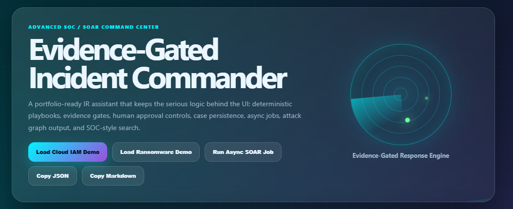
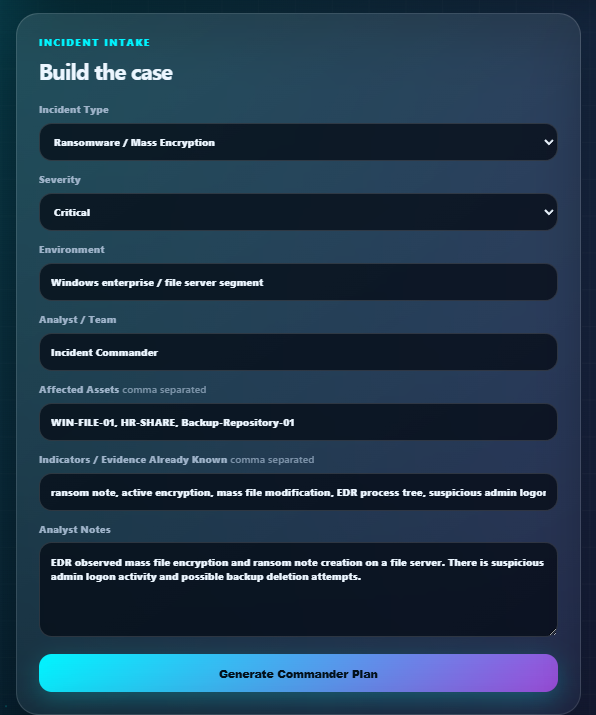
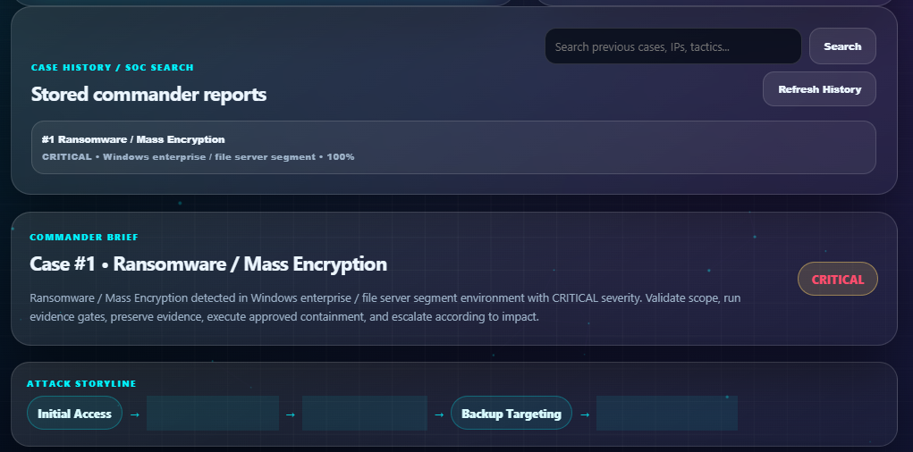
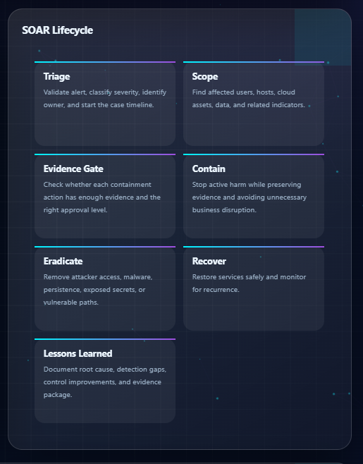
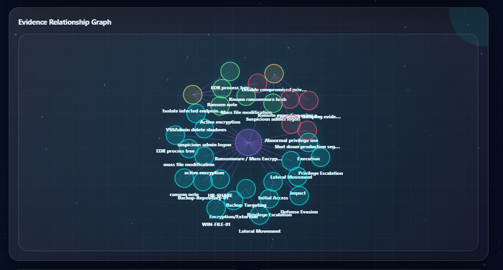
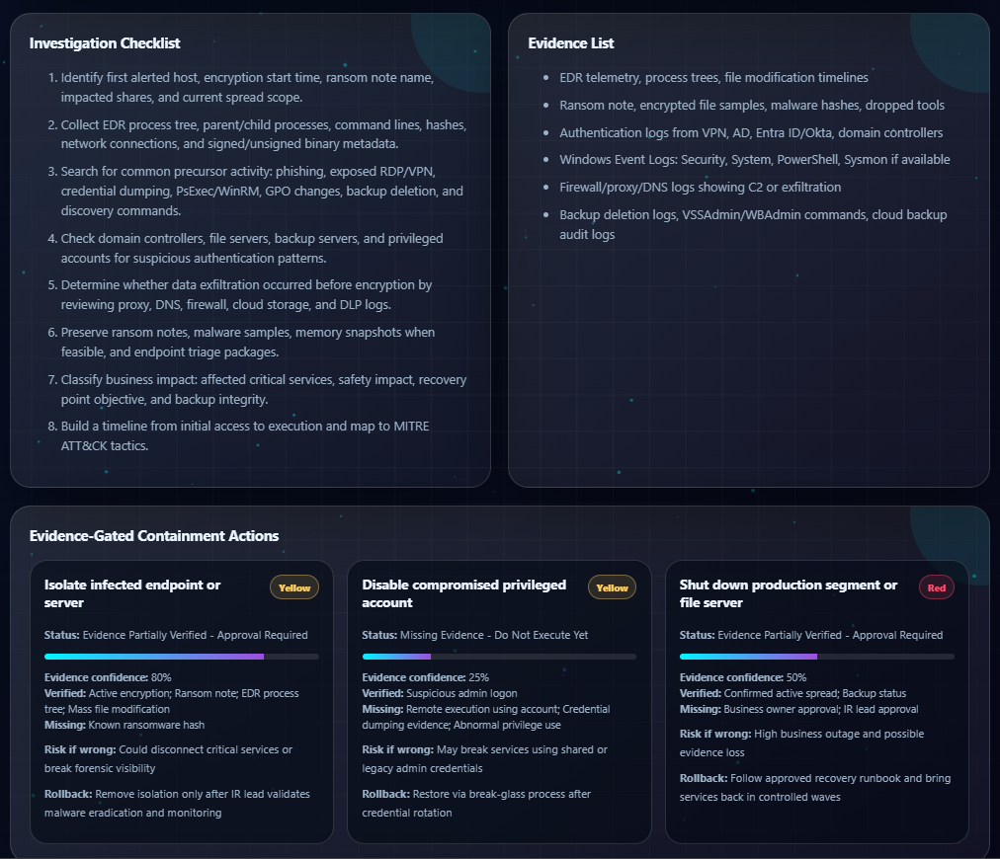
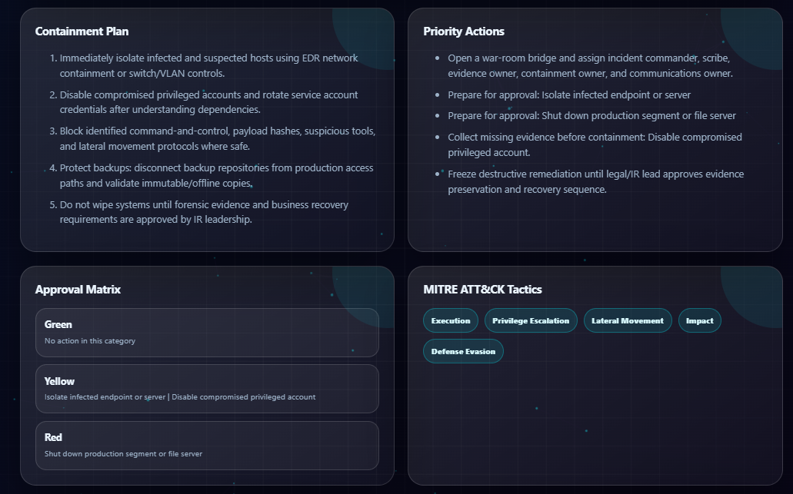
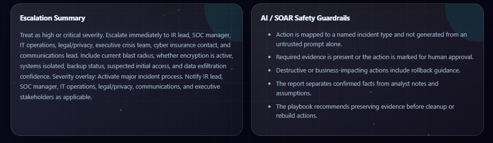
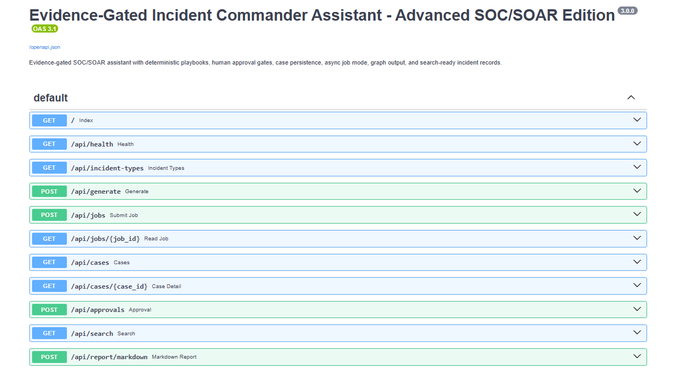
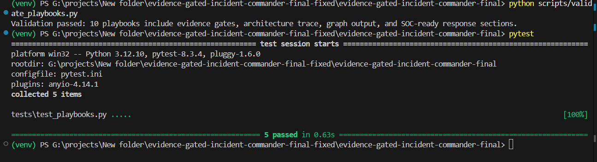

# Evidence-Gated Incident Commander Assistant


An advanced SOC/SOAR-style incident response assistant that generates incident-specific investigation checklists, containment plans, evidence requirements, escalation summaries, MITRE-style attack storylines, approval gates, rollback guidance, case history, and an evidence relationship graph.

This project is designed as a **portfolio-ready cybersecurity project** that demonstrates real incident response thinking instead of only showing a static checklist generator.

---

## Project Summary

Security teams often need to respond quickly to incidents such as ransomware, phishing, cloud IAM abuse, endpoint malware, insider threats, and data exfiltration. A normal checklist can tell analysts what to do, but it may not explain **what evidence is required before taking risky containment actions**.

This project solves that problem by using **evidence-gated response logic**.

For every incident, the assistant asks:

- What type of incident is this?
- What evidence is already known?
- What assets are affected?
- Which actions are safe to automate?
- Which actions require analyst approval?
- Which actions require IR lead or management approval?
- What could go wrong if the action is wrong?
- What rollback plan is needed?

---

## What Makes This Project Different

Most basic SOAR projects generate static steps like:

```text
Isolate host
Disable account
Block IP
Escalate incident
```

This project goes further by generating decision-aware actions like:

```text
Action: Suspend user access
Approval Level: Red
Status: Missing Evidence - Do Not Execute Yet
Verified Evidence: Business continuity plan
Missing Evidence: Active exfiltration, HR/legal approval, manager coordination
Risk If Wrong: Could create employment/legal risk and disrupt business
Rollback: Reinstate least-privilege access after formal decision
```

That makes the project closer to how a real SOC incident commander thinks during an active incident.

---

## Key Features

- Animated SOC command-center dashboard
- FastAPI backend with Swagger documentation
- Evidence-gated SOAR decision engine
- 10 incident response playbooks
- Investigation checklist generation
- Containment plan generation
- Evidence list generation
- Escalation summary generation
- MITRE-style attack storyline
- Evidence relationship graph
- Green / Yellow / Red approval matrix
- Risk-if-wrong and rollback guidance
- Case history and SOC-style search
- Async SOAR job simulation
- SQLite local case storage
- PostgreSQL / Redis / Celery / Neo4j / OpenSearch-ready architecture
- Validation script and Pytest tests
- Optional Docker Compose deployment
- Optional Next.js frontend starter

---

## Incident Types Supported

| Incident Type | Description |
|---|---|
| Phishing / BEC | Suspicious email, credential harvesting, business email compromise |
| Ransomware | Encryption activity, ransom note, file modification, backup targeting |
| Credential Compromise | Account takeover, impossible travel, MFA abuse, suspicious login |
| Endpoint Malware | Suspicious process, malware behavior, endpoint compromise |
| Cloud IAM Abuse | Unauthorized API calls, access key creation, privilege escalation |
| Data Exfiltration | Unusual egress, sensitive data movement, external transfer |
| Web Application Attack | WAF alerts, injection attempts, suspicious web activity |
| Lateral Movement | Internal recon, remote execution, credential reuse |
| Insider Threat | DLP alert, unusual access, external sharing, HR/legal workflow |
| Vulnerability Exploitation | Public CVE abuse, exploit activity, exposed service compromise |

---

## Inputs Taken by the System

The analyst enters:

| Input Field | Example |
|---|---|
| Incident Type | Ransomware / Mass Encryption |
| Severity | Low, Medium, High, Critical |
| Environment | Windows enterprise / file server segment |
| Analyst / Team | SOC Analyst, SOC L2, IR Lead |
| Affected Assets | WIN-FILE-01, HR-SHARE, Backup-Repository-01 |
| Indicators / Evidence | ransom note, active encryption, EDR process tree |
| Analyst Notes | Multiple files encrypted and ransom note found on file server |

---

## Example Output

For a ransomware incident, the assistant can generate:

```text
Attack Storyline:
Initial Access → Privilege Escalation → Lateral Movement → Backup Targeting → Encryption/Extortion

Evidence-Gated Action:
Isolate infected endpoint or server

Approval:
Yellow - Analyst approval required

Verified Evidence:
Active encryption, ransom note, EDR process tree, mass file modification

Missing Evidence:
Known ransomware hash

Risk If Wrong:
Could disconnect critical services or break forensic visibility

Rollback:
Remove isolation only after IR lead validates eradication and monitoring
```

---

## Architecture

```text
Dashboard UI
   ↓
FastAPI API Layer
   ↓
Evidence-Gated Decision Engine
   ↓
Case Database: SQLite locally / PostgreSQL in Docker mode
   ↓
Async Job Layer: Local async simulation / Celery-ready worker
   ↓
Graph Layer: Inline graph output / Neo4j-ready persistence
   ↓
Search Layer: Local JSONL search / OpenSearch-ready indexing
   ↓
Human Approval Log
```

---

## Tech Stack

| Layer | Technology |
|---|---|
| Backend API | FastAPI |
| Data Validation | Pydantic |
| Database ORM | SQLAlchemy |
| Local Database | SQLite |
| Advanced Database Option | PostgreSQL |
| Async Job Simulation | Local job queue |
| Advanced Queue Option | Redis + Celery |
| Graph Concept | Evidence relationship graph |
| Advanced Graph Option | Neo4j |
| Search Concept | Local JSONL search index |
| Advanced Search Option | OpenSearch |
| Frontend | HTML, CSS, JavaScript |
| Optional Frontend | Next.js |
| Testing | Pytest |
| Deployment Option | Docker Compose |

---

## Folder Structure

```text
app/
  main.py                  FastAPI routes
  schemas.py               Request/response models
  playbooks.py             Incident playbooks
  decision_engine.py       Evidence-gated SOAR logic
  database.py              Database setup
  models.py                SQLAlchemy models
  repository.py            Case persistence
  worker.py                Worker task structure
  services/
    commander.py           Main report generation service
    evidence_graph.py      Graph builder
    search_index.py        Search indexing
    job_queue.py           Async job queue

static/
  index.html               Dashboard UI
  styles.css               Dashboard styling
  app.js                   Frontend logic and API calls

scripts/
  validate_playbooks.py    Validates playbooks and response structure
  reset_demo_data.py       Clears local demo cases and search history

tests/
  test_playbooks.py        Unit tests

frontend-next/
  Optional Next.js frontend starter

Screenshots/
  README screenshots
```

---

## Run Locally

### 1. Clone the Repository

```powershell
git clone https://github.com/YOUR-USERNAME/evidence-gated-incident-commander.git
cd evidence-gated-incident-commander
```

If you already downloaded the project ZIP, open PowerShell inside the project folder.

### 2. Create a Virtual Environment

```powershell
python -m venv venv
```

### 3. Activate the Virtual Environment

```powershell
venv\Scripts\activate
```

### 4. Install Requirements

```powershell
pip install -r requirements.txt
```

### 5. Validate the Playbooks

```powershell
python scripts/validate_playbooks.py
```

Expected output:

```text
Validation passed: 10 playbooks include evidence gates, architecture trace, graph output, and SOC-ready response sections.
```

### 6. Run Tests

```powershell
pytest
```

Expected output:

```text
5 passed
```

### 7. Start the Application

```powershell
uvicorn app.main:app --reload
```

Open the dashboard:

```text
http://127.0.0.1:8000
```

Open FastAPI Swagger docs:

```text
http://127.0.0.1:8000/docs
```

---

## Clean Demo Data Before Screenshots

To remove old test cases and keep the case history clean:

```powershell
python scripts/reset_demo_data.py
```

Then restart the application:

```powershell
uvicorn app.main:app --reload
```

---

## API Endpoints

| Method | Endpoint | Purpose |
|---|---|---|
| GET | `/api/health` | Check application health |
| GET | `/api/incident-types` | List supported incident types |
| POST | `/api/generate` | Generate commander response plan |
| POST | `/api/jobs` | Start async SOAR job simulation |
| GET | `/api/jobs/{job_id}` | Check async job status |
| GET | `/api/cases` | View stored cases |
| GET | `/api/cases/{case_id}` | View a specific case |
| GET | `/api/search?q=keyword` | Search stored incidents |
| POST | `/api/approvals` | Record approval decisions |
| POST | `/api/report/markdown` | Generate Markdown report |

---

## Example API Request

```powershell
curl -X POST "http://127.0.0.1:8000/api/generate" `
  -H "Content-Type: application/json" `
  -d '{"incident_type":"ransomware","severity":"critical","environment":"Windows enterprise / file server segment","affected_assets":["WIN-FILE-01","HR-SHARE","Backup-Repository-01"],"indicators":["ransom note","active encryption","mass file modification","EDR process tree","suspicious admin logon"],"notes":"Multiple shared folders are encrypted and a ransom note was found."}'
```

---

## Screenshots

### 1. SOC Command Center Dashboard



### 2. Incident Intake Form



### 3. Ransomware Commander Brief



### 4. SOAR Lifecycle



### 5. Evidence Relationship Graph



### 6. Evidence-Gated Containment Actions



### 7. Approval Matrix and MITRE Mapping



### 8. Case History and SOC Search



### 9. FastAPI Swagger Documentation



### 10. Validation and Tests



---

## Docker Compose Run

Use Docker mode to show a more advanced SOC/SOAR architecture.

```powershell
docker compose up --build
```

Then open:

```text
http://127.0.0.1:8000
```

Neo4j browser:

```text
http://127.0.0.1:7474
```

OpenSearch endpoint:

```text
http://127.0.0.1:9200
```

Stop services:

```powershell
docker compose down
```

Remove volumes:

```powershell
docker compose down -v
```

---

## Optional Next.js Frontend

The default dashboard is already served by FastAPI. An optional Next.js starter is included for future frontend expansion.

```powershell
cd frontend-next
npm install
npm run dev
```

Open:

```text
http://127.0.0.1:3000
```

---

## Accuracy Statement

This project should not be described as “98% real-world accurate.”

Use this wording instead:

```text
The system uses a 98%+ playbook confidence target based on playbook coverage, evidence completeness, and response consistency. Real-world accuracy would require validation using historical incidents, analyst review, tabletop exercises, false positives, and false negatives.
```

---

## Interview Explanation

Use this explanation:

```text
I built an Evidence-Gated Incident Commander Assistant to simulate how a SOC/SOAR platform supports incident response decisions. Instead of generating static checklists, the system maps each incident type to investigation steps, evidence requirements, containment actions, MITRE-style attack storylines, approval gates, risk-if-wrong notes, rollback guidance, and escalation summaries.

The unique part is the evidence-gated decision engine. The tool does not blindly recommend risky containment. For example, collecting logs can be Green and automation-ready, but disabling an account, isolating a production host, or suspending a user can be Yellow or Red depending on the evidence available and the business risk.

I used FastAPI for the API layer, SQLAlchemy for case persistence, local async jobs to simulate SOAR background processing, an evidence graph that is Neo4j-ready, and a search index that can work locally or with OpenSearch. The UI is animated, but the main technical value is the backend decision logic and evidence validation process.
```

---

## GitHub Repository Description

```text
Advanced SOC/SOAR Incident Commander Assistant with evidence-gated response logic, investigation checklists, containment plans, MITRE-style attack storylines, approval gates, rollback guidance, case persistence, async job simulation, graph output, and SOC search.
```

---

## Notes for GitHub Upload

Do not upload these folders/files:

```text
venv/
.pytest_cache/
__pycache__/
Screenshots.zip
*.db
*.sqlite
```

Keep this folder:

```text
Screenshots/
```

because the README uses those images.

---

## Author

**Gurukiran Shivashankar**  
M.S. Cybersecurity  
SOC Analyst / Cybersecurity Analyst Portfolio Project
